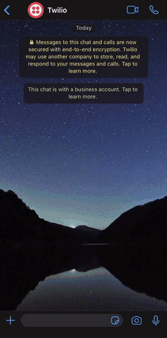

# Scheduler assistant with Twilio Autopilot

A flask application that lets user interact with a Google Calendar. The operations:

- Book appointment
- List upcoming appointment
- Modify upcoming appointment
- Cancel upcoming appointment

It uses the <a target="_blank" href="https://developers.google.com/calendar/">Google Calendar API</a> and its designed to work with <a target="_blank" href="https://www.twilio.com/autopilot">Twilio Autopilot</a>

This is how it works:

<p align="center">
  
</p>

## Requirements:

```
cachetools==4.1.1
certifi==2020.6.20
chardet==3.0.4
click==7.1.2
Flask==1.1.2
google-api-core==1.22.2
google-api-python-client==1.12.2
google-auth==1.21.3
google-auth-httplib2==0.0.4
google-auth-oauthlib==0.4.1
googleapis-common-protos==1.52.0
httplib2==0.18.1
idna==2.10
itsdangerous==1.1.0
Jinja2==2.11.2
MarkupSafe==1.1.1
oauthlib==3.1.0
protobuf==3.13.0
pyasn1==0.4.8
pyasn1-modules==0.2.8
python-dateutil==2.8.1
python-dotenv==0.14.0
pytz==2020.1
requests==2.24.0
requests-oauthlib==1.3.0
rsa==4.6
six==1.15.0
uritemplate==3.0.1
urllib3==1.25.10
Werkzeug==1.0.1
```
